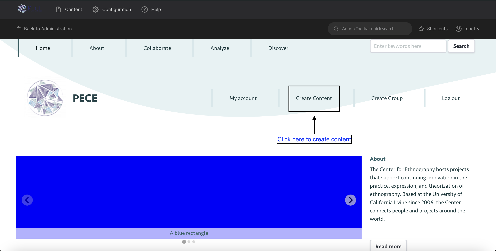
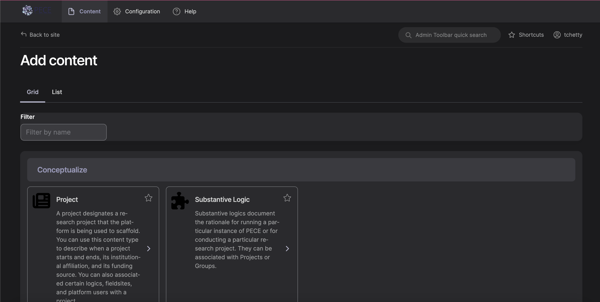
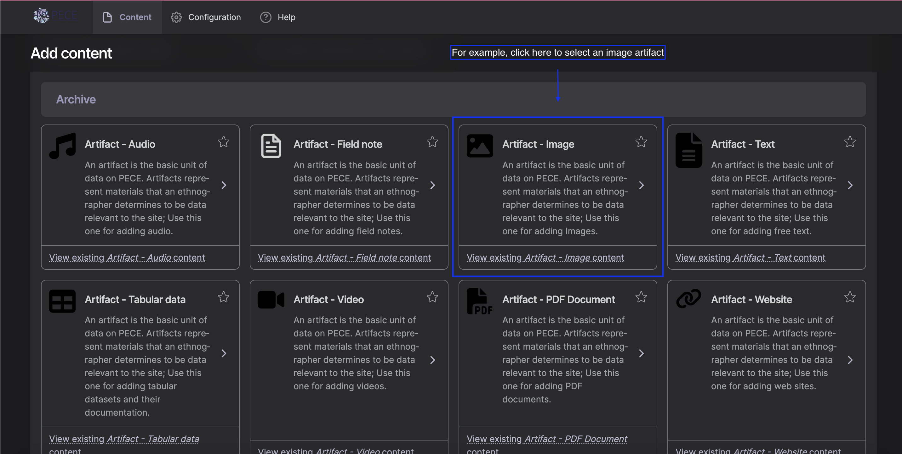
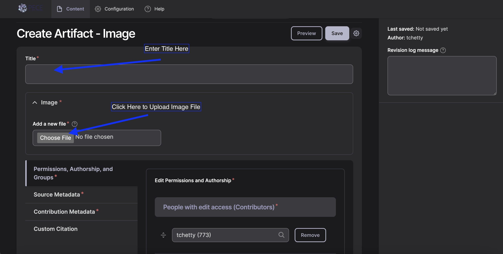
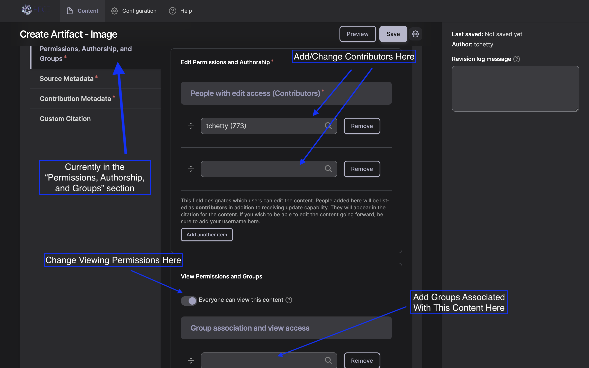
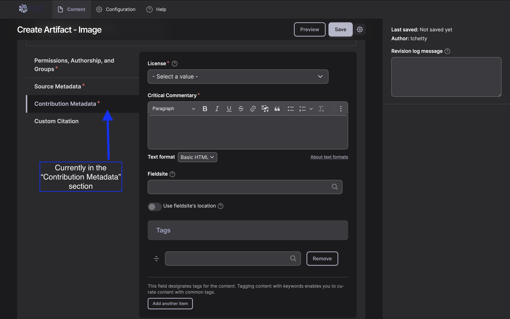
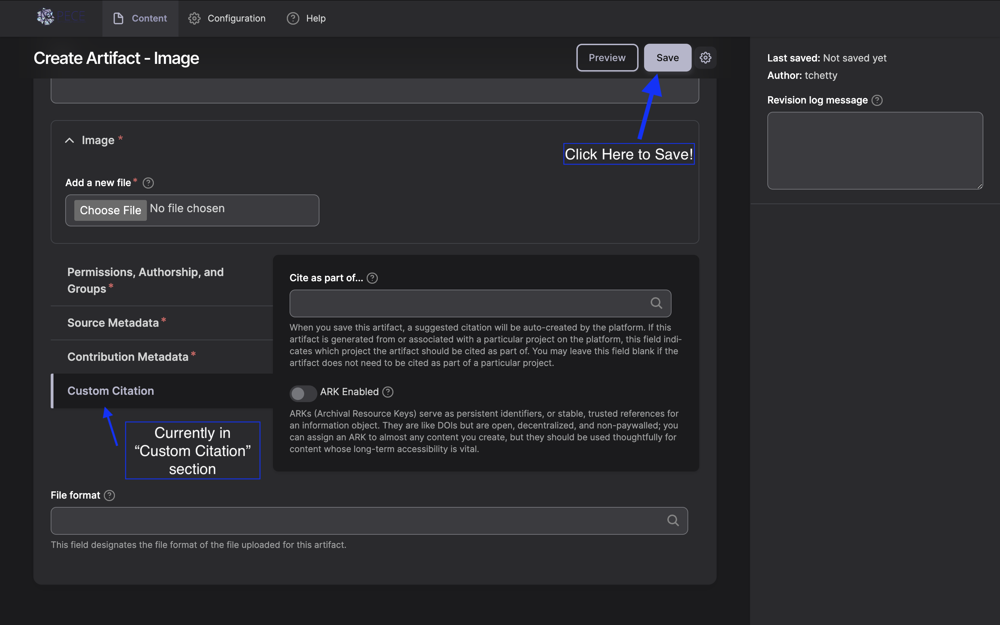

Steps to Create an Artifact

The process of adding any variety of content to PECE begins by logging in with your screen name and password and clicking “Create Content” in the top right corner.

You should now see the "Add content" page.

On this page you will find a grid of options for creating different forms of new content followed by their brief descriptions. “Artifacts” are one type of content. An artifact is the basic working unit of PECE; once, created, artifacts are then used in photo essays (for image artifacts only), timelines, or PECE Essays (both of which accept images, video, documents, and any other type of artifact)

You can add many types of artifacts, including audio files, video, images, pdf, text, and websites. Within the "Archive" section of content types, you will see all the artifact options.

Next, click the type of artifact you want to create.

You should now have access to all of the fields you need to fill out in order to create a new image artifact. First, type the title of your image in the “Title” pane.

Next, upload your artifact by clicking the "Choose file" button and selecting the name of the file you would like to upload. 

Click “Open” to upload the file into PECE. Depending on the size of the file it may take a few seconds or minutes to upload; a small icon for the file will appear once uploading is complete.
Add Alt Text as desired.

Next, scroll down to the metadata fields. The menu bar on the left side will automatically be open to the "Permission, Authorship, and Groups" section. Your screen name should already appear in the first contributor field. Listed contributors have the ability to edit the content, and are also credited as content contributors when the content is published. To add the names of any other project members who you would like to grant access to editing the artifact, type the first few letters of their name into the other “contributor” field. To add more than one additional contributor, click the "add another item" button and enter their name in the new field.

Next, scroll down to the "View Permission and Groups" section. The button switch will automatically set viewing permissions to "Everyone can view this content," making the artifact visible to all internet users. If you want to restrict access to the content, click the button switch to turn this off.
If you choose to leave the toggle on, you can still associate the content with a particular group. To do so, complete the "Group association and view access." You can select a group with which to associate the content by typing its name into the field.
If you choose to restrict access to the content, you can designate specific people or groups that will have view access. To allow specific people viewing access, in the field, "People with view access" type the first few letters of their name and select their username. Add groups whose members should have view access to this memo by typing the group name into the "Group association and view access" field. **Note that if you give a group view access, it will also associate the content with that group. This means the content will appear on the group's page.**

Next, click on the “Source Metadata" section on the left side menu bar. Fill out the section, making sure to follow any project- specific instructions. You may also include the format, language, or location associated with the image if you feel as though they are important or interesting to the meaning or usefulness of the image. Otherwise you may choose to leave them blank.

Click Save.
Next, fill out the "Contribution Metadada" section, making sure to select the correct license and add any critical commentary. For the license, we encourage you to leave it as Attribution, Share Alike CC BY-SA, but you can choose any of the other Creative Commons license as you see fit. Descriptions of available creative commons licenses can be found <a href=”https://creativecommons.org/share-your-work/cclicenses/”>here</a>.

If you wish to associate this artifact with a fieldsite that you have already created in the platform, you can do so by typing the Title for that fieldsite into the "Fieldsite" field. 

Tag the content. As you type, suggested tags will be automatically generated if they exist already in the system. We recommend following theses suggestions and using existing tags if they are not too different from what you were intending, but feel free to make up new tags!

Next, fill out the "Custom Citation" section, using your platform's preferred citation format.

Next, you can fill out the "File format" section to indicate the file format of the artifact.

Finally, scroll back up to the top of the page and click “Save” to save your work. And remember: all of these settings can be revised at a later time: private artifacts can be made public later, and vice versa, for example.

**FAQs**

What is the difference between a text artifact and a field note?

A text artifact and a fieldnote are technically very similar. However, unlike a text artifact, a fieldnote will not have a title; the date the fieldnote was created will become the title. Also a fieldnote will appear in the field diary on user’s dashboard. If associated with a group, a fieldnote will also appear under the Field Diary tab of the group’s page, ordered by the date created.

What is an artifact bundle, and why would I use it?

An artifact bundle is an artifact that links to several other existing artifacts. You can create an artifact bundle so that you may annotate a group of artifacts together.

What is “critical commentary”?

In this field, you should provide commentary on the artifact that documents its significance as an ethnographic objects and why it is relevant to the platform.

How do I list the creator (author, photographer, composer) of a piece of content when they are not part of the system?

When creating an artifact, the Creator field can be used to designate the author of a piece of content when that creator is not a user of the system. Technically, this field is a tag. This means that if content in the system has already been tagged with the creator, you should be given the option to select this creator’s name when you begin typing in this field. Otherwise, upon saving the artifact, the creator’s name will become a new “Creator tag” in the system.

When I edit content, what should I include in the revision log message?

If a researcher cites a piece of content on the platform on a particular date, and then the content creator revises the content on a later date, it is important to be able to track which version of the PECE content the researcher was citing. PECE enables users to track changes made to content over time. In the revision log message section, users should summarize changes they make the content, so that it is easier to track the changes. See <i><a href=”https://pece-project.github.io/drupal-pece/artifacts/#where-can-i-access-older-versions-of-content”>Where can I access older versions of content?</a></i> for where to track these changes.

Where can I access older versions of content?

When logged in, navigate to the content. Click on the ‘Revisions’ tab. If there is no ‘Revisions’ tab, it means that no changes have been made to the content. Under the ‘Revisions’ tab, you can click on a date - time under the Revisions column to access older versions of the content. You can also compare a newer version of content to an older version by selecting two versions under the Compare column and clicking the ‘Compare’ button.

Can I download files from the platform?

You cannot download files that are listed as All Rights Reserved. Please see the <i><a href=”https://creativecommons.org/licenses/>Licensing</a></i> section for more information about this. Audio files and video files that have been added as a part of Open artifacts can be downloaded from the platform. Navigate to the artifact page where the file is displayed. In the bottom right hand corner of the rendered file, there will be an upside down arrow. Click this button to download the file.

PDF files that have been added as part of Open artifacts can also be downloaded from the platform. Navigate to the artifact page where the file is displayed. When you hover over the PDF viewer, a bar will display at the top. In the upper right hand corner of this bar, there will be an upside down arrow. Click this button to download the file.

Right now, there is not a simple way to download image files. You can right click on the image and Save the file to your computer however.

Can I add a Youtube or Vimeo video to the platform?

Currently, you cannot embed a YouTube for Vimeo video in the platform.

Can I add a map to the platform?

Currently the only way to share a map on the platform is by capturing an image of it and uploading it to the site as an image artifact, or alternatively by uploading a link to the map as a Website artifact.
