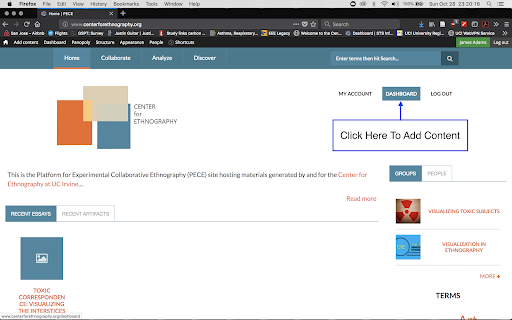
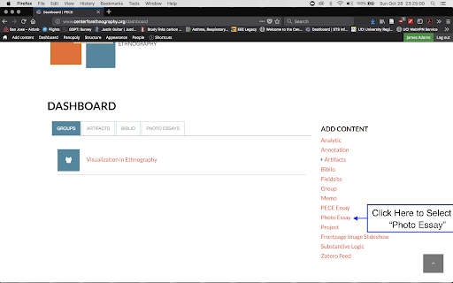
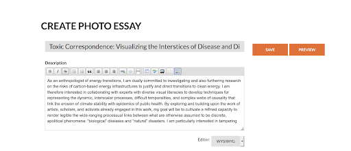
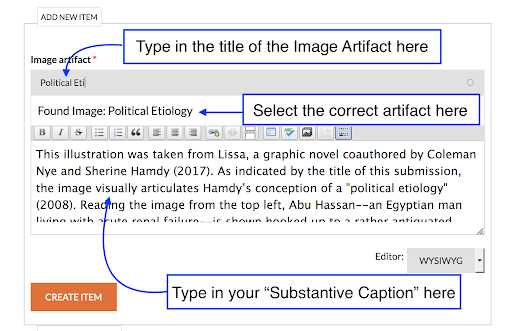
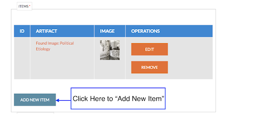
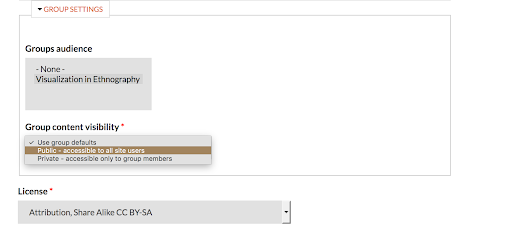
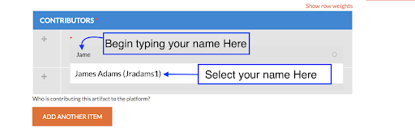
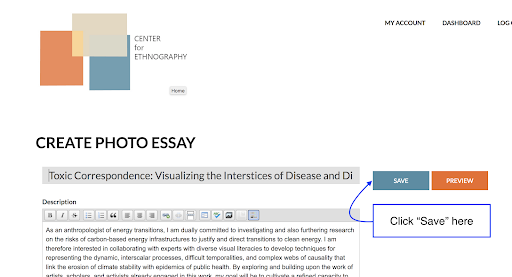

Essays
======
### What is the difference between a memo, a photo essay, and a PECE essay?

A memo is a first draft of a piece of writing that may be published on
the site. Upon publishing a memo, that memo is opened for comments from
the platform’s community.

A photo essay is a collection of image artifacts, ordered into a
slideshow, with text added for context. For an example of a photo essay,
see [here](http://theasthmafiles.org/content/6-united-states-environmental-health-governance-timeline)

A PECE essay is a collection of artifacts, memos, and essays, organized
into a collage, with text added for context. For an example of a PECE
essay, see [here](https://disaster-sts-network.org/content/lead-poisoning-and-information-distribution-southern-california/essay)

### How do I create a memo?

Navigate to your ‘Dashboard’. This link will be listed in the main menu.
Under the ‘Add Content’ heading, select ‘Memo’. You will be directed to
a web form to create the content. Enter the relevant fields (explained
in other parts of this document). Save the content.

### How do I create a photo essay?

For an overview of how to create photo essays, see [*this YouTube video*](https://www.youtube.com/watch?v=Z2K9nrp4j74).

Step-by-step

<ol> <!-- Step 1 -->
<li> Begin by logging into the PECE platform and navigating to your Dashboard. </li>

<li> Click “Photo Essay” </li> <!-- Step 2 -->

<li> You should now have access to all of the fields you need to fill out in order to create a new Photo Essay.
<ul>
  <li> First, type the title in the “Title” pane.</li>
  <li> Next, write out your project description in the “Description” section. </li>
</ul> </li>

<li> Next Choose a “thumbnail” image to represent your essay.
<ul>
  <li> You can edit this image later </li>
  <li> Click “Next” to upload the image. Type in Alt Text and/or Title Text as desired (you can simply leave these blank), and click save. </li>
</ul>

   You are now ready to upload your image artifacts into your Photo Essay. </li>

<li> Begin by typing the title of the image artifact into the “Image Artifact” pane. Your Image Artifact should pop up as an option to select.
<ul>
  <li>Click on the title of your Image Artifact to select it. </li>
</ul>

   Next, type in the “Substantive Caption” into the “Text” pane.
<ul>
  <li> Click “Create Item”. </li>
</ul> </li>

<li> Once this artifact is added, click “Add New Item.” Repeat Step 5 for your remaining Image Artifacts. </li>

<li> If you would like this essay to appear in a group, be sure to select the Group Audience.
<ul>
  <li>Select “Public” to make it accessible to all viewers</li>
  <li>Select “Private” to limit visibility to Group Members</li>
</ul> </li>

<li> Select a license for the content. (See [licensing](../licensing) for more information) </li>

<li> Next, add yourself as a contributor by typing the first few letters of your name into the “contributor” field. Your screen name should pop up. Select your name.
<ul>
  <li> Repeat this process with the names of any other group members who you would like to grant access to editing the image or caption. </li>
</ul> </li>

<li> Tag the Essay with any tags that you find appropriate.
   If the essay is not ready to be made public, you can alter the permissions of the image.  
  <ul>
  <li> Select “Private” to limit visibility to yourself and other contributors.</li>
  <li> Select “Restricted” to limit visibility to PECE users.</li>
  <li> Select “Open” to make the essay visible to all internet users.</li>
  </ul> </li>

<li> Finally, scroll back up to the top of the page and click “Save” to save your work. </li>

Congratulations! You’ve created your Photo Essay!

### How do I reorder photos in a photo essay?

Once you’ve created photo essay items, you can reorder photos by
clicking and holding on the ‘+’ symbol next to the item and dragging the
item to a new order.

### How do I create a PECE essay?

Navigate to your ‘Dashboard’. This link will be listed in the main menu.
Under the ‘Add Content’ heading, select ‘PECE Essay’. You will be
directed to a web form to create the content. Enter the relevant fields.
Save the content. This first step will only capture the metadata for the
essay.

To design the essay, navigate to the essay page you just created and
click ‘View Essay’. At the bottom of the screen there will be a black
bar that says ‘Customize this page’. Click this button to begin to the
customize the page.

To add content to the page, click the ‘+’ button in the blue ‘Content’
box. From this screen, you can add image files (not artifacts; just the
images), maps, free text, content (artifact, annotations, memos, and
essays) stored elsewhere on the platform, and headers for specific
portions of the essay. To add content stored elsewhere on the platform,
click the ‘Add Content’ button, begin typing the title of the content,
and select the appropriate content from the drop-down list. Select a
view mode from the drop-down menu below. A preview of how the content
will be rendered will appear on the right of the screen. Click Save.

To reorder content on the page, after you’ve clicked the ‘Customize this
page’ button, you can click and hold on content boxes and drag them to
new locations.

Once you’re done creating your essay, click the ‘Save’ button in the
black box at the bottom of the page.

For an overview of how to create PECE essays, see this YouTube video.

### How do I comment on publications?

Navigate to the memo, photo essay, or PECE Essay that you would like to
comment on. As long as you are logged in, you will see a heading to ‘Add
New Comment’ on the bottom of the page. Enter a subject, a comment, and
click ‘Save’.

