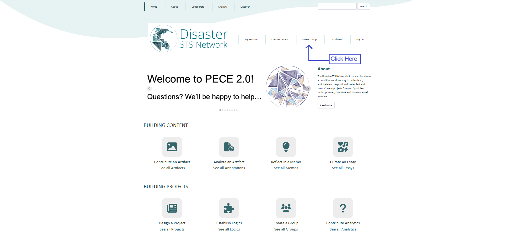
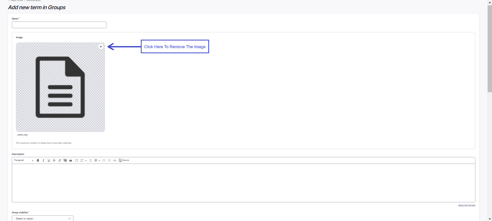
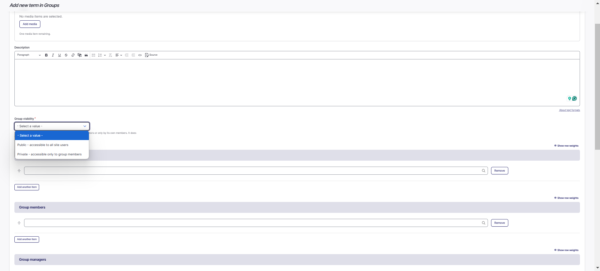

Groups
==========

### Overview

Steps to Create Group
--------------------------

1. Navigate to ‘Create Group’. This link is listed in the main menu.

    

2. Select to add a group. You will be directed to a web form to create your group.

3. Enter a title in the "Name" textbox for your new group.

4. In the "Image" field, you can upload an image related to your group by first removing the placeholder image and clicking "Add media".

    

    

5. Add a description related to your group, in the "Description" textbox.

6. The "Group visibility" field, determines whether the group can be viewed by all site visitors or only by its own members. 
It does not determine the visibility of group content. Select whether you would like your group to be publicly or privately visible.

    

7. The "Substantive logic" provides the opportunity to describe the rational behind the creation of the group. 
You may select a substantive logic by typing in the first few letters and making a selection from the drop-down menu.

8. If there are any other group members or managers, add them by typing the first few letters of their name into the field. 
Their screen name should pop up. Select their name. To add more than one contributor, click the "Add another item" button and repeat the same process.

9. Next, add optional keyword tags to your timeline essay. Tag the content. As you type, suggested tags will be automatically generated if they already exist in the system. 
We recommend following these suggestions and using existing tags if they are not too different from what you intended, but feel free to make up new tags!

10. The "Relations" field allows you to select group(s) that are related to the current sub-group being made. 
Type in the first few letters and a drop-down menu of groups to choose from will appear.

    

11. Finally, click “Save” at the top of the page to save your work. 
And remember: all of these settings can be revised at any time. You are now the group administrator.

Steps to Join a Group
--------------------------

1. Navigate to ‘Collaborate’. This tab is listed on the main menu bar.
Here, you will find all of the open groups.

    

2. Navigate by clicking through the arrows on the bottom of the pages, or by searching if you know the
name of the group.

    

3. Once you locate the group, click on the link to navigate to the group page.

4. [To be revised, no current way to join a group from the website] 
Contact the group manager to join the group.

Steps to Manage Group Memberships 
--------------------------

1. If you created a group or have been appointed as an administrator of a
group, navigate to the group’s page from your dashboard or from the “Collaborate” link.

    To do this from your dashboard, click the edit button next to your group's name or click "See and sort all my managed groups".

    

    To do this from the "Collaborate" link, select your group to navigate to the group page. Click the "Edit" link where you can manage group memberships. Save your changes.

    

### Approving a Group Member [The below is to be revised, no current way to approve]

1. To approve a group membership for a Pending user, click edit at the end of the row with their username.

2. Change their membership Status to "Active".

3. Select group user roles for the user.

4. Click "Update Membership".

### Changing a Group Member's roles 

1. To change a group member's role, navigate to the group's page and select "Edit".

2. Select "Remove" next to the group member's username under the category of their current role.

3. Add the group member by their username under the category of the new role.

### Deleting a Group Member

1. To delete a group member, navigate to the group's page and select "Edit".

2. Scroll down to "Group members" and click "Remove" next to their name.

Adding Artifacts to Groups [Link to be changed for the artifacts]
-----------------------------------------

1. Follow instructions to [add an artifact](../artifacts), and designate the group you would like to assocaite it with in the "View Permissions and Groups".

