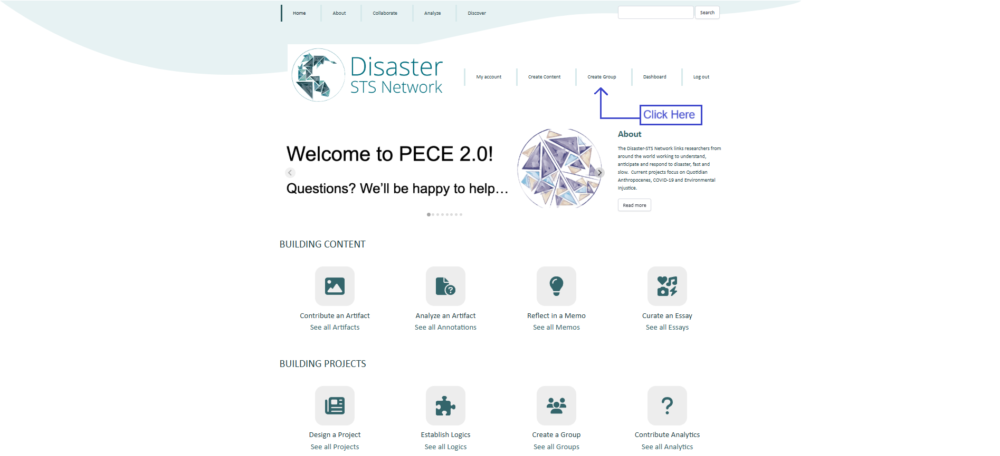
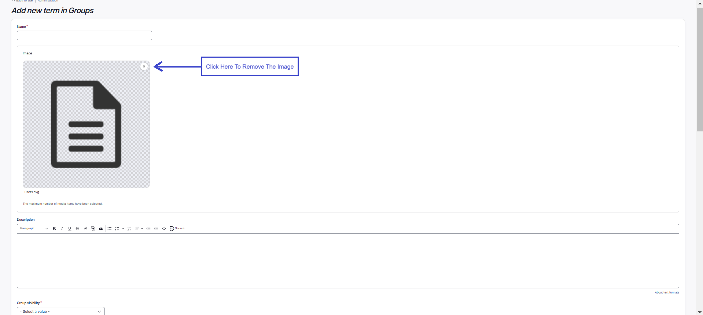
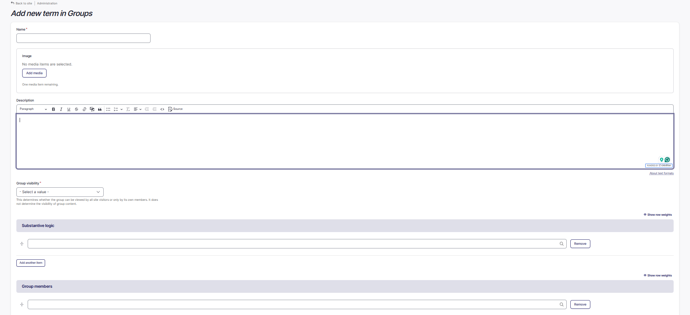
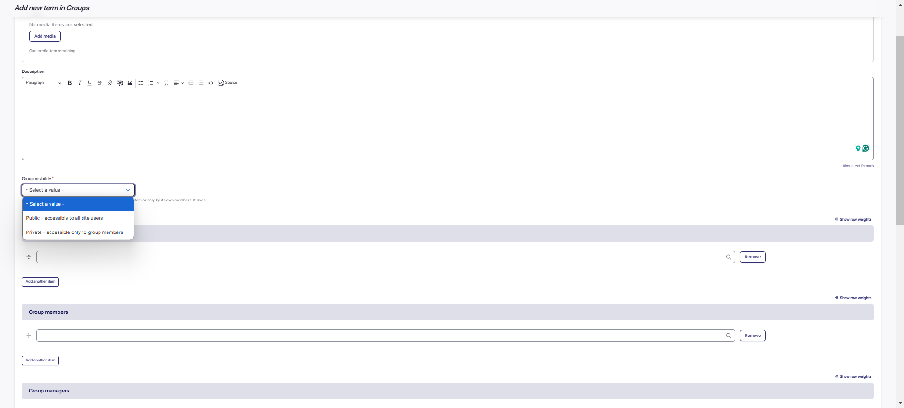
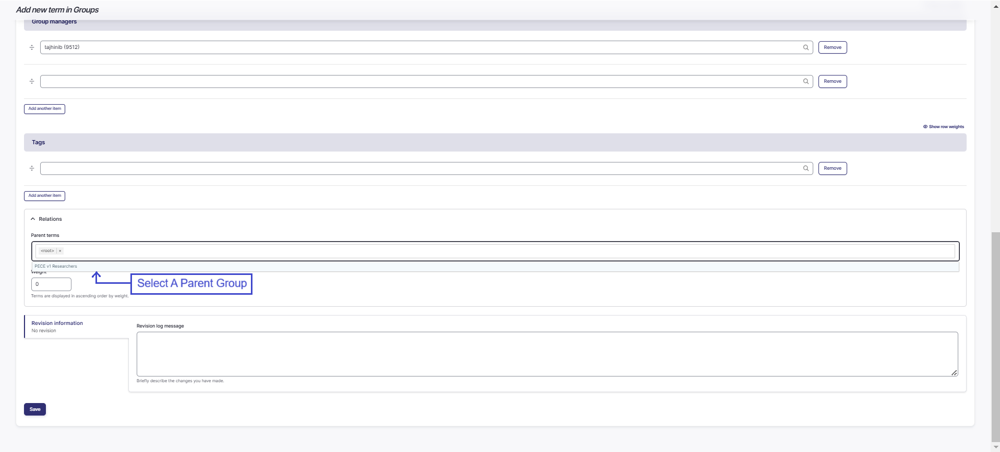

Groups
==========

### Overview

Steps to Create Group
--------------------------

1. Navigate to ‘Create Group’. This link is listed in the main menu.

    

2. Select to add a group. You will be directed to a web form to create your group.

3. Enter a title in the "Name" textbox for your new group.

4. In the "Image" field, you can upload an image related to your group by first removing the placeholder image and clicking "Add media".

    

    

5. Add a description related to your group, in the "Description" textbox.

6. The "Group visibility" field, determines whether the group can be viewed by all site visitors or only by its own members. 
It does not determine the visibility of group content. Select whether you would like your group to be publicly or privately visible.

    

7. The "Substantive logic" provides the opportunity to describe the rational behind the creation of the group. 
You may select a substantive logic by typing in the first few letters and making a selection from the drop-down menu.

8. If there are any other group members or managers, add them by typing the first few letters of their name into the field. 
Their screen name should pop up. Select their name. To add more than one contributor, click the "Add another item" button and repeat the same process.

9. Next, add optional keyword tags to your timeline essay. Tag the content. As you type, suggested tags will be automatically generated if they exist already in the system. 
We recommend following these suggestions and using existing tags if they are not too different from what you intended, but feel free to make up new tags!

10. The "Relations" field allows you to select group(s) that are related to the current sub-group being made. 
Type in the first few letters and a drop-down menu of groups to choose from will appear.

    

11. Finally, click “Save” at the top of the page to save your work. 
And remember: all of these settings can be revised at any time. You are now the group administrator.

Steps to Join a Group
--------------------------

1. Navigate to ‘Collaborate’. This tab is listed on the main menu bar.
Here, you will find all of the open groups.

    

2. Navigate by clicking through the arrows on the bottom of the pages, or by searching if you know the
name of the group.

    

3. Once you locate the group, click on the link to navigate to the group page.

4. [To be revised, no current way to join a group] Click ‘Subscribe to group’ on the right hand of the screen. The group administrator will
have to approve your request before you are considered a member of a
group, and this may take some time. Once you are listed as a member, you
should be able to begin associating content with a group.

Steps to Manage Group Memberships 
--------------------------

1. If you created a group or have been appointed as an administrator of a
group, navigate to the group’s page from your dashboard or from the “Collaborate” link.

    To do this from your dashboard, click the edit button next to your group's name or 
    click "See and sort all my managed groups".

    

    To do this from the "Collaborate" link, select your group to navigate to the group page. Click the "Edit" link where you can manage group memberships. Save your changes.

    

2. [To be revised] Click on the Group tab in the edit menu. (You will not see this tab if you are not a group owner.)

3. [To be revised] Select the link ‘People.’ Here you can see a list of site users that have requested to join the group or that have already been approved. If a user has been approved, their State will be listed as "Active"; otherwise, their State will be listed as "Pending".

### Approving a Group Member [The below is to be revised, no current way to approve]

1. To approve a group membership for a Pending user, click edit at the end of the row with their username.

2. Change their membership Status to "Active".

3. Select group user roles for the user.

4. Click "Update Membership".

### Changing a Group Member's roles 

1. To change a group member's role, navigate to the group's page and select "Edit".

2. Select "Remove" next to the group member's username under the category of their current role.

3. Add the group member by their username under the category of the new role.

### Deleting a Group Member

1. To delete a group member, navigate to the group's page and select "Edit".

2. Scroll down to "Group members" and click "Remove" next to their name.

Adding Artifacts to Groups [To be edited]
-----

1. Follow instructions to [add an artifact](../artifacts), and designate the Group Audience to which you would like the group added.

Adding Artifacts Other Users Created to Groups
-----

1. Navigate to the content you’d like to add to a group.

2. Click on the “Edit Group Audience” tab.

3. Select the group to which you would like to add the content.

4. Save the content.

Frequently Asked Questions
--------------------------

### I’ve requested membership to a group, but I cannot add to it, and it is not listed in my Dashboard. What is going on?

Currently when you request membership to a group, the button on the
group page changes to read “Unsubscribe from Group” even though you have
not yet been approved by the group admin as a group member. If you
requested membership to a group and cannot add to it, you likely have
not yet been approved. You should contact to the group administrator,
which will soon be listed on the group page.

### What do the different group membership roles mean?

A group manager is the person responsible for stewarding the group on PECE. The manager has the ability to make edits to the group itself and to add or remove members. 
Group members have access to view artifacts, essays, etc when the view permissions for that content have been restricted to the group. 
Administrators can manage groups as described above. **There is no
difference between a researcher and a contributor in a group.**

### I’m trying to approve a user’s request to join a group, and I keep getting an error. What’s going on?

This is a bug that has happened to a few group managers over the past
couple of months. We don’t quite know what is going on. However, if this
keeps happening, delete the user’s request to join the group and then
add the user manually by navigating to the group page, clicking on the
group tab, and then clicking the “Add People” link.

### How do I add content to multiple groups?

Follow the same protocol for adding content, but when selecting “group
audience” select multiple groups by holding the “ctrl” key and clicking
as many groups as you would like to associate the content to. Users may
associate (or unassociate) content with groups at any time. **Note that
when adding content to multiple groups, the [*group content visibility*](../permissions#group-content-permissions) field will be applied to all of
the groups that the content is associated with.** There is no way to
override this.

### How do I make a group a sub-group of another group?

Navigate to ‘Dashboard’. This link is listed in the main menu. Select
the ‘group” link under “Add Content.” Follow the steps to create a
group. Under the “Group Audience” field, select the group that you would
like to be the parent of this sub-group. Save the group.

### I’ve made a new group a sub-group of an existing group? Why is the content in the sub-group not appearing in the parent group?

Sub-groups are simply pointers to parent groups. Parent groups do not
adopt the content of their sub-groups. This feature simply lets users
know that there is a hierarchical relationship between the groups.
