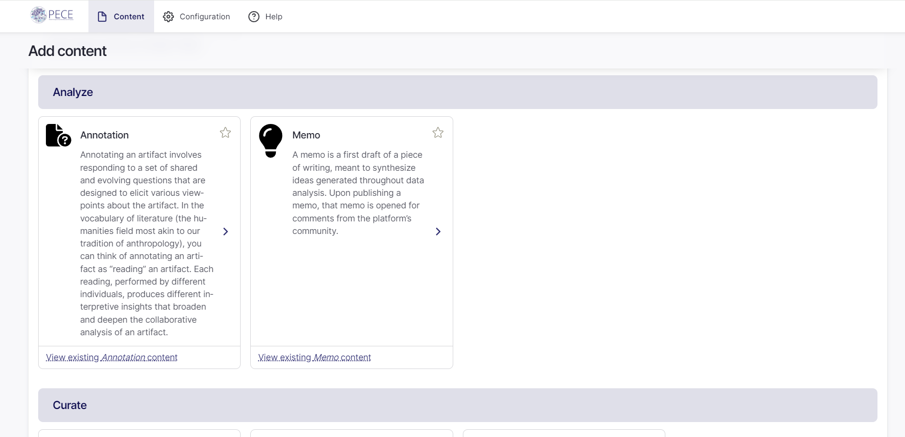
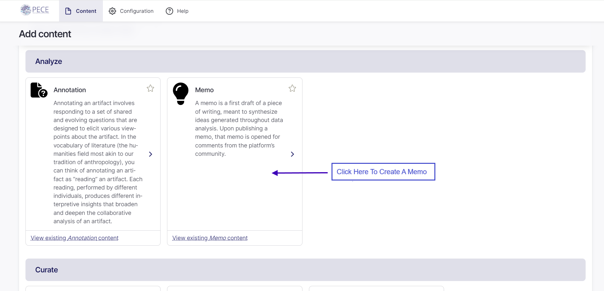
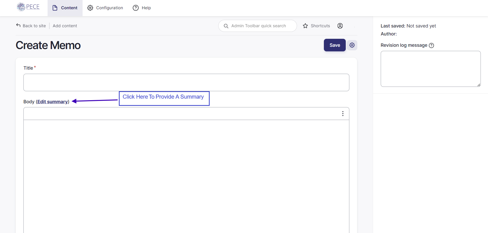
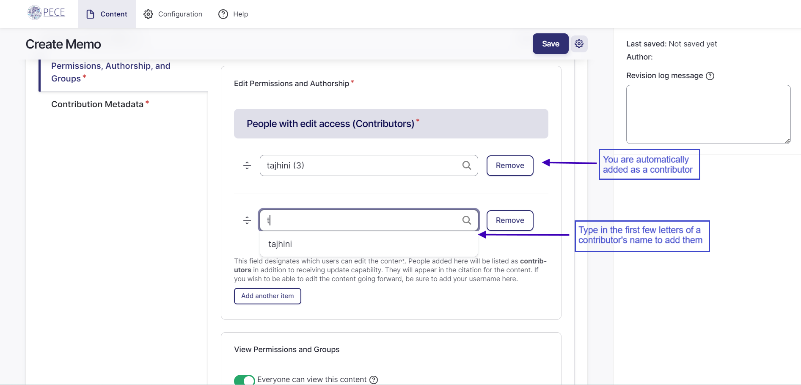
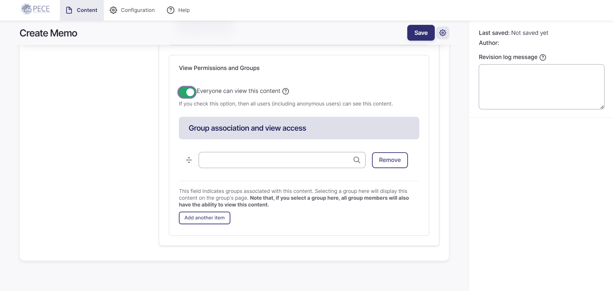
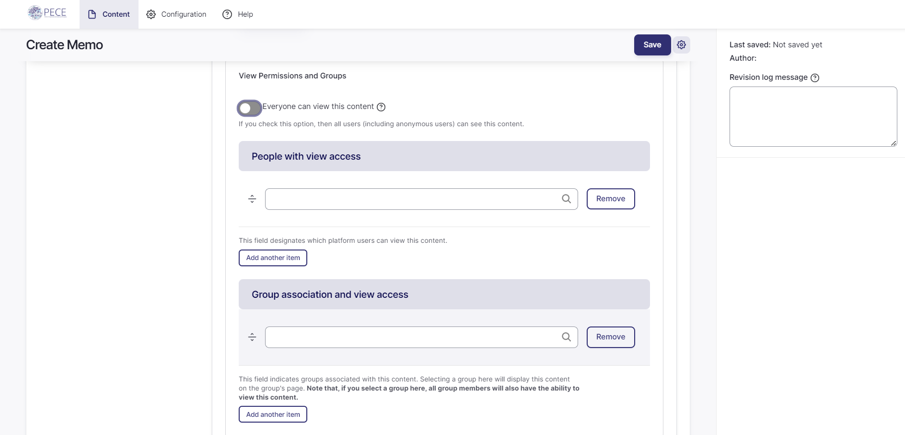
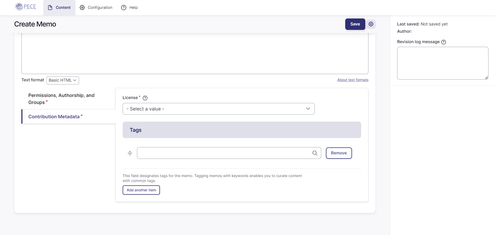
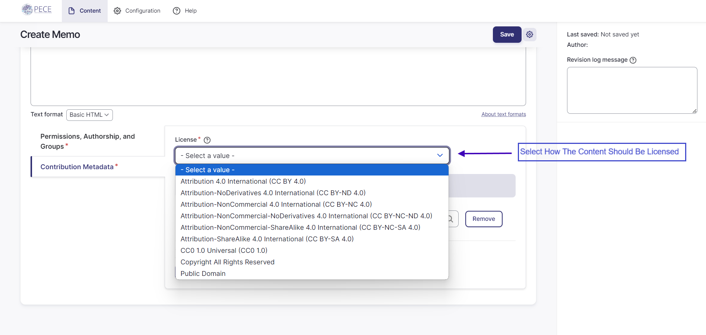
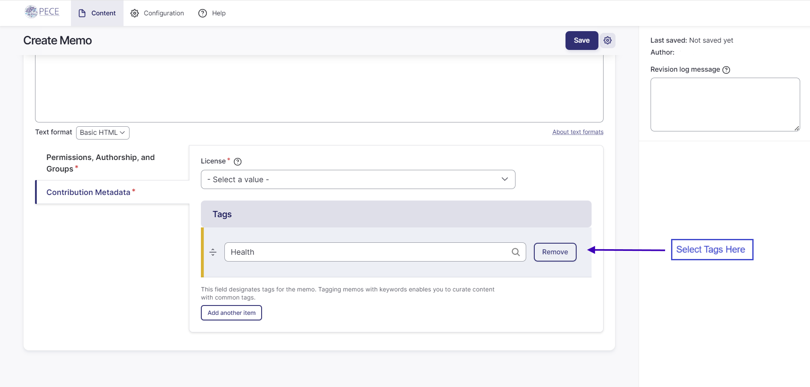
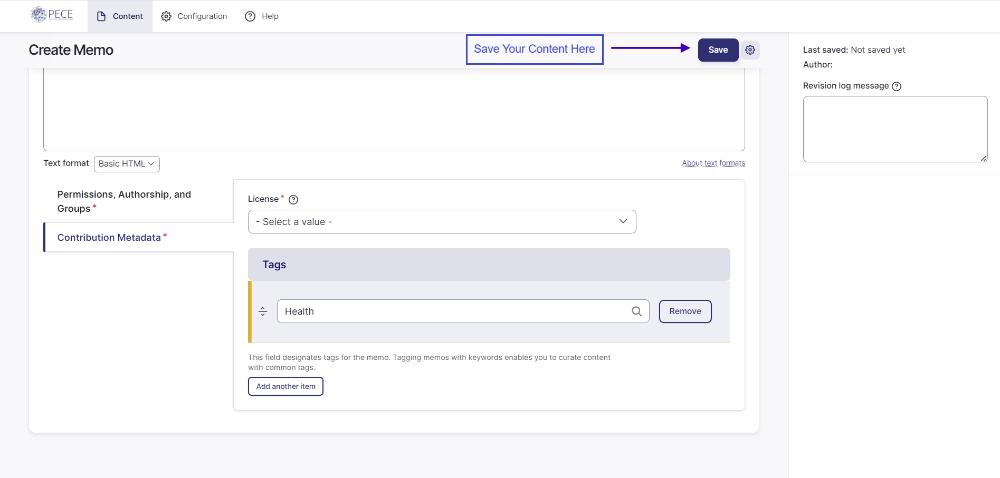

Memo
=====================

Steps to Create a Memo
---------------------------------------
1. The process of adding any variety of content to PECE begins by logging in with your screen name and password and clicking “Create Content” in the top right corner.

    

2. You should now see the "Add content" page.

    

    As you scroll down the page, you can find thumbnails 
    for creating different forms of new content. Each is organised under a category. "Memo" can be found under the category "Analyze". "Memo" is one of the types of content. A memo is a first draft of a piece of writing, meant to synthesize ideas generated throughout data analysis. Upon publishing a memo, that memo is opened for comments from the platform's community.

    

3. To create a memo, click on the "Memo" thumbnail. 

    

4. This takes you to the "Create Memo" page. You should now have access to all of the fields you need to fill out in order to create a new memo. First, type the title of your memo in the “Title” field.

    

5. Type your memo into the "Body" field.
    To provide a summary of your memo, click the "Edit summary" link next to "Body".

    

6. Next are two tabs: "Permissions, Authorship, and Groups" and "Contribution Metadata". The "Permissions, Authorship, and Groups" should be automatically opened. 

    In the "Edit Permissions and Authorship" section, you should be automatically added as a contributor as your username. Listed contributors have the ability to edit the content, and are also credited as content contributors when the content is published. If there are any other contributors, add them by typing the first few letters of their name into the field. Their screen name should pop up. Select their name. To add more than one contributor other than yourself, click the "Add another item" button and repeat the same process.

    

7. Next, in the "View Permissions and Groups", you will come across the "Everyone can view this content" toggle. By default, the toggle will be set to on, meaning everyone on the Web can view the content. If you want to restrict access to the content, turn this off. 

    If you choose to leave the toggle on, you can still associate the content with a particular group. To do so, complete the "Group association and view access." You can select a group with which to associate the content by typing its name into the field. 

    

    If you choose to restrict access to the content, you can designate specific people or groups that will have view access. Add the people who should have view access to this memo by typing their screen name into the "People with view access" field. Add groups whose members should have view access to this memo by typing the group name into the "Group association and view access" field. **Note that if you give a group view access, it will also associate the content with that group. This means the content will appear on the group's page.**

    

8. Next, click on the "Contribution Metadata" tab.

    

9. Complete the "License" field by selecting a license from the drop-down menu. This indicates how the content should be licensed. We encourage you to leave it as Attribution, Share Alike CC BY-SA, but you can choose any of the other Creative Commons licenses as you see fit. Please refer to the [*Licensing*](https://creativecommons.org/share-your-work/cclicenses/) section for more information.

    

10. Next, add optional keyword tags to your memo. Tag the content. As you type, suggested tags will be automatically generated if they exist already in the system. We recommend following theses suggestions and using existing tags if they are not too different from what you were intending, but feel free to make up new tags!

    

11. Finally, click “Save” at the top of the page to save your work. And remember: all of these settings can be revised at any time: private artifacts can be made public later, and vice versa, for example.

    

Frequently Asked Questions
---------------------------------------

### What is the difference between a text artifact and a memo?

A text artifact and a memo are similar but conceptually and architecturally different. A text artifact is writing that acts as a piece of data that will be analysed while a memo is a first draft of writing that is used to meditate on findings and data analysis. Architecturally, a memo can be commented on while a text artficat can be annotated.

